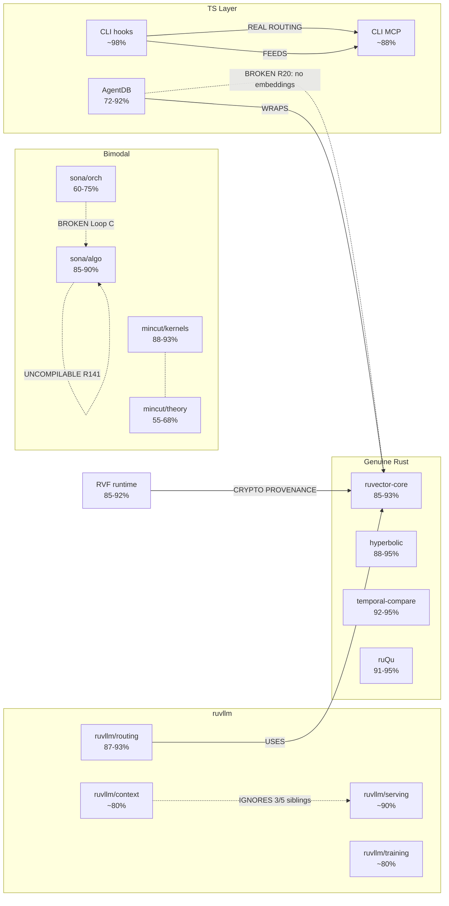

# ADR-v4-007: Subsystem Dependency Graph

> **Status**: Proposed (revised 2026-03-03 with R115-R142 data)
> **Date**: 2026-02-19 (original), 2026-03-03 (updated)
> **Deciders**: Research project lead
> **Supersedes**: None
> **Related**: ADR-v4-008 (Reuse Inventory), SPEC.md, README-REALITY-CHECK.md

---

## Context

After 142 research sessions producing 1,696 DEEP file reads across 15,612 files, no single artifact captures how the ecosystem's components *connect to each other*. The existing artifacts are:

| Artifact | What it captures | What it misses |
|----------|-----------------|----------------|
| MASTER-INDEX.md | Per-file statistics (3,973 lines) | Too large for one context window; no connections |
| 14 domain synthesis docs | Per-domain narratives and findings | Cross-domain connections buried in prose; too large combined |
| README-REALITY-CHECK.md | Feature-by-feature verdicts | Organized by marketing claims, not by subsystem topology |
| GENUINE-ASSETS.md | File extraction manifest | No dependency relationships between assets |
| research.db | Raw data (files, findings, 2,247 deps) | File-level granularity too fine; no subsystem aggregation |

The result: when starting a v4 implementation session, you must either:
1. Load multiple large docs (exceeding context), or
2. Guess which docs contain the relevant cross-cutting information

Neither approach supports confident reasoning about the full architecture.

## Decision

Build a **Subsystem Dependency Graph** — a single artifact (~3-6 pages) that:
1. Groups the 14,633 files into ~25-35 named subsystems
2. Maps directed dependency edges between subsystems (with edge types)
3. Annotates each subsystem with realness score and file counts
4. Renders as both a Mermaid diagram and a queryable adjacency list

This graph becomes the **primary navigation artifact** for all v4 architectural reasoning.

## Subsystem Definition

A subsystem is a cohesive group of files at the **crate + directory** level. Subsystems are defined by these rules:

1. **Each Rust crate with DEEP files = 1 subsystem** (crates with 0 DEEP files are folded into a parent or omitted)
2. **Bimodal crates split into 2 subsystems** when the internal quality variance exceeds 30pp (e.g., mincut-kernels vs mincut-theory)
3. **Each top-level TS/JS module directory = 1 subsystem** (e.g., `claude-flow-cli/dist/`, `agentdb/src/`)
4. **The self-implemented DDD repo = 1 subsystem** (not in research.db — tracked separately)

### Proposed Subsystem List (~30 nodes)

Derived from actual DB data: packages × crate directories, filtered to those with 3+ DEEP files.

#### Rust Subsystems (from ~/repos/)

| ID | Name | Package / Crate Dir | DEEP | Total | Realness Source |
|----|------|---------------------|------|-------|-----------------|
| R1 | ruvector-core | ruvector-rust / ruvector-core | 15 | 55 | Synthesis docs: 85-93% |
| R2 | ruvector-graph | ruvector-rust / ruvector-graph | 12 | 70 | Synthesis docs: 40-80% bimodal |
| R3 | ruvector-postgres | ruvector-rust / ruvector-postgres | 29 | 243 | Synthesis docs: 78-88% |
| R4 | ruvector-gnn | ruvector-rust / ruvector-gnn | 13 | 17 | Synthesis docs: 70-86% bimodal |
| R5 | ruvector-mincut | ruvector-rust / ruvector-mincut + ruvector-mincut-gated-transformer | 54 | 176 | Synthesis docs: 62-93% bimodal |
| R6 | hyperbolic-hnsw | ruvector-rust / ruvector-hyperbolic-hnsw + ruvector-attention | 23 | 83 | Synthesis docs: 88-95% |
| R7 | prime-radiant | ruvector-rust / prime-radiant | 41 | 151 | Synthesis docs: 82-93% |
| R8 | ruvllm | ruvector-rust / ruvllm | 87 | 205 | Synthesis docs: mixed (serving ~90%, context ~80%, training ~80%) |
| R9 | sona | ruvector-rust / sona | 27 | 39 | Synthesis docs: algo 85-90%, orch 60-75% |
| R10 | ruQu | ruvector-rust / ruQu + ruqu-core | 15 | 83 | Synthesis docs: 91-95% |
| R11 | cognitum-gate | ruvector-rust / cognitum-gate-kernel + cognitum-gate-tilezero | 6 | 36 | Synthesis docs: ~85% |
| R12 | rvlite | ruvector-rust / rvlite | 5 | 96 | Synthesis docs: 82-86% |
| R13 | sublinear-src | sublinear-rust / src/ | 156 | 201 | Synthesis docs: mixed (backward-push 95%, others vary) |
| R14 | neural-net | sublinear-rust / neural-network-implementation | 45 | 86 | Synthesis docs: 75-85% |
| R15 | psycho-symbolic | sublinear-rust / psycho-symbolic-reasoner | 45 | 116 | Synthesis docs: bimodal |
| R16 | temporal-compare | sublinear-rust / temporal-compare | 18 | 25 | Synthesis docs: 92-95% |
| R17 | ruv-swarm | ruv-fann-rust / ruv-swarm/ (root) | 208 | 765+ | Synthesis docs: 8-95% extreme bimodal |
| R18 | agentic-flow-rust | agentic-flow-rust / (root) | 171 | 3542+ | Synthesis docs: varies |

#### TypeScript/JavaScript Subsystems

| ID | Name | Package / Dir | DEEP | Total | Realness Source |
|----|------|--------------|------|-------|-----------------|
| T1 | claude-flow-cli | claude-flow-cli / dist/ + .claude/ | 119 | 517 | Synthesis docs: hooks ~98%, MCP ~88%, rest ~85% |
| T2 | agentdb | agentdb / src/ + dist/ + simulation/ | 82 | 401 | Synthesis docs: 72-92% bimodal |
| T3 | agentic-flow-js | agentic-flow / dist/ + .claude/ | 140 | 476+ | Synthesis docs: varies, much theatrical |
| T4 | claude-config | claude-config / plugins/ + agents/ + commands/ | 103 | 437 | Synthesis docs: ~85% |
| T5 | custom-src (self-impl) | custom-src / agentdb-integration/ | 8 | 45 | Synthesis docs: 85-92% |
| T6 | agentic-flow-rust-packages | agentic-flow-rust / packages/ | 47 | 1219 | Synthesis docs: varies |

#### Not in DB (tracked separately)

| ID | Name | Location | Status |
|----|------|----------|--------|
| EXT1 | claude-flow-self-implemented | ~/claude-flow-self-implemented/ | Not in research.db. ~80 files, 76 commits. DDD architecture sound per SPEC.md |

> **Note (2026-03-03)**: File counts above are approximate as of R112. R115-R142 added ~178 DEEP reads and ~31 new files to the DB. The exact per-subsystem counts should be recomputed from the DB during Phase 1 execution. Key changes: T1 (claude-flow-cli) gained significant DEEP coverage from ML-A through ML-F sessions.

## Edge Types

Edges between subsystems carry a **type** and **strength**:

| Edge Type | Meaning | Example |
|-----------|---------|---------|
| `USES` | Runtime dependency — A calls B's API | ruvllm `USES` ruvector-core |
| `WRAPS` | A provides a higher-level API over B | agentdb `WRAPS` ruvector-core |
| `COMPETES` | A and B implement the same capability independently | 12 persistence layers `COMPETES` with each other |
| `FEEDS` | A produces data consumed by B | hooks `FEEDS` ReasoningBank |
| `BROKEN` | Intended dependency that doesn't actually work | sona orch `BROKEN` sona algo (Loop C missing) |
| `IGNORES` | A should use B but doesn't | ruvllm context `IGNORES` ruvllm serving (2/5 siblings) |

Edge strength:
- **STRONG**: Confirmed by multiple DEEP reads with specific code evidence
- **WEAK**: 1-2 references, or inferred from directory structure
- **CLAIMED**: Documented/commented but no runtime evidence found

## What the Data Can and Cannot Tell Us

This section is critical for honest construction. The research DB has real limits.

### What the DB CAN provide

| Data | Source | Reliability |
|------|--------|-------------|
| File → subsystem mapping | `files.relative_path` + `files.package_id` | HIGH — path heuristics are deterministic |
| Intra-subsystem dependency counts | `dependencies` table (1,597 intra-package) | HIGH — but doesn't reveal subsystem-level structure |
| Cross-package dependency skeleton | `dependencies` table (~150+ cross-package edges, up from 107 at R112) | MEDIUM — real but still sparse relative to 2,247 total deps |
| Finding severity distribution | `findings` table (1,294 CRITICAL, 2,923 HIGH) | HIGH — useful as quality signal |
| File depth and LOC | `files` table | HIGH |

### What the DB CANNOT provide

| Data | Why Not | Where It Actually Lives |
|------|---------|------------------------|
| **Realness scores** | No `realness_score` column exists. Scores are human-assigned per-file during DEEP reads. | Synthesis docs prose, MEMORY.md session summaries |
| **Cross-subsystem semantic edges** | 93.7% of deps are intra-package. The 107 cross-package deps are a skeleton, not the full graph. | Synthesis docs prose, findings descriptions, MEMORY.md |
| **BROKEN/IGNORES/COMPETES edges** | These are architectural judgments, not import relationships. The DB records `imports` relationships, not "should import but doesn't." | Synthesis docs, MEMORY.md "Key Corrections" sections |
| **Normalized edge types** | 300+ distinct relationship strings in DB, ranging from `"imports"` to `"EdgeFullSonaEngine fallback stores training state via IntelligenceStore persistence layer"` | Would require normalization pass |

### New Data Sources (R115-R142)

The Middle Layer sessions and compilation audit provide data that wasn't available when this ADR was drafted:

| Data Source | Session(s) | What It Adds |
|-------------|-----------|-------------|
| **R141 Compilation Audit** | R141 | Binary pass/fail for 115 crates. Replaces subjective realness estimates with ground truth for "can this code actually run?" |
| **Middle Layer trace** (ML-A to ML-F) | R135-R140 | Complete CLI→MCP→tool→memory→backend chain traced. ~500 new findings with rich cross-subsystem signal. |
| **RVF ecosystem** | R119-R124 | New subsystem not in original list: RVF store/runtime/NAPI bridge. Would be ~R19 in the subsystem graph. |
| **Consensus/Distribution** | R129 | ruvector-raft, delta-consensus assessed. Enriches R2 (ruvector-graph) and adds potential R19 (rvf) edges. |
| **NAPI bridge verification** | R116-R117 | Confirms working Rust→TS bridge path. Adds STRONG edges between R1 and T1/T2. |

These sources would make Phase 3 (prose mining) significantly richer and reduce the need for synthesis doc reading.

### Implication

The subsystem graph is **primarily a knowledge extraction problem**, not a SQL aggregation problem. The DB provides the scaffolding (file counts, package boundaries, a sparse cross-package skeleton), but the actual graph edges — especially the architecturally valuable BROKEN/IGNORES/COMPETES edges — must be mined from prose.

## Construction Method

### Phase 1: Subsystem Assignment via Path Heuristics (~1 hour)

Add subsystem mapping to the DB using `relative_path` LIKE patterns. This is deterministic and automatable.

```sql
-- New tables
CREATE TABLE IF NOT EXISTS subsystems (
  id TEXT PRIMARY KEY,            -- e.g. 'R1', 'T2'
  name TEXT UNIQUE NOT NULL,
  package_id INTEGER REFERENCES packages(id),
  path_pattern TEXT NOT NULL,     -- LIKE pattern for matching
  description TEXT,
  realness_range TEXT,            -- e.g. '85-93%' (manually entered from synthesis docs)
  category TEXT CHECK(category IN ('rust', 'typescript', 'external', 'dead'))
);

CREATE TABLE IF NOT EXISTS file_subsystems (
  file_id INTEGER REFERENCES files(id),
  subsystem_id TEXT REFERENCES subsystems(id),
  PRIMARY KEY (file_id, subsystem_id)
);
```

Population uses path patterns:

```javascript
const mappings = [
  // Rust — ruvector-rust package
  { id: 'R1',  name: 'ruvector-core',     pkg: 'ruvector-rust', pattern: 'crates/ruvector-core/%' },
  { id: 'R2',  name: 'ruvector-graph',    pkg: 'ruvector-rust', pattern: 'crates/ruvector-graph/%' },
  { id: 'R3',  name: 'ruvector-postgres', pkg: 'ruvector-rust', pattern: 'crates/ruvector-postgres/%' },
  { id: 'R4',  name: 'ruvector-gnn',      pkg: 'ruvector-rust', pattern: 'crates/ruvector-gnn%' },
  { id: 'R5',  name: 'ruvector-mincut',   pkg: 'ruvector-rust', pattern: 'crates/ruvector-mincut%' },
  { id: 'R6',  name: 'hyperbolic+attention', pkg: 'ruvector-rust', pattern: 'crates/ruvector-hyperbolic%' },
  // ... (also crates/ruvector-attention%)
  { id: 'R7',  name: 'prime-radiant',     pkg: 'ruvector-rust', pattern: 'crates/prime-radiant/%' },
  { id: 'R8',  name: 'ruvllm',            pkg: 'ruvector-rust', pattern: 'crates/ruvllm/%' },
  { id: 'R9',  name: 'sona',              pkg: 'ruvector-rust', pattern: 'crates/sona/%' },
  { id: 'R10', name: 'ruQu',              pkg: 'ruvector-rust', pattern: 'crates/ruQu/%' },
  // ... etc for remaining crates

  // Rust — sublinear-rust package
  { id: 'R13', name: 'sublinear-src',      pkg: 'sublinear-rust', pattern: 'src/%' },
  { id: 'R14', name: 'neural-net',         pkg: 'sublinear-rust', pattern: 'crates/neural-network%' },
  { id: 'R15', name: 'psycho-symbolic',    pkg: 'sublinear-rust', pattern: 'crates/psycho-symbolic%' },
  { id: 'R16', name: 'temporal-compare',   pkg: 'sublinear-rust', pattern: 'crates/temporal-compare/%' },

  // Rust — ruv-fann-rust package (mostly flat)
  { id: 'R17', name: 'ruv-swarm',          pkg: 'ruv-fann-rust', pattern: '%' },

  // TS/JS packages
  { id: 'T1',  name: 'claude-flow-cli',    pkg: 'claude-flow-cli', pattern: '%' },
  { id: 'T2',  name: 'agentdb',            pkg: 'agentdb', pattern: '%' },
  { id: 'T3',  name: 'agentic-flow-js',    pkg: 'agentic-flow', pattern: '%' },
  { id: 'T4',  name: 'claude-config',      pkg: 'claude-config', pattern: '%' },
  // ... etc
];

// For each mapping, INSERT into subsystems then populate file_subsystems
for (const m of mappings) {
  const pkgId = db.prepare('SELECT id FROM packages WHERE name = ?').get(m.pkg)?.id;
  db.prepare('INSERT OR IGNORE INTO subsystems (id, name, package_id, path_pattern, category) VALUES (?, ?, ?, ?, ?)')
    .run(m.id, m.name, pkgId, m.pattern, m.id.startsWith('R') ? 'rust' : 'typescript');
  db.prepare(`
    INSERT OR IGNORE INTO file_subsystems (file_id, subsystem_id)
    SELECT f.id, ? FROM files f
    WHERE f.package_id = ? AND f.relative_path LIKE ?
  `).run(m.id, pkgId, m.pattern);
}
```

**Outcome**: Every file assigned to a subsystem. Files not matching any pattern go to a catch-all per package. Estimated ~30-40 LIKE patterns needed to cover all subsystems.

**Effort**: ~1 hour to write and run the script. Verify with `SELECT subsystem_id, COUNT(*) FROM file_subsystems GROUP BY subsystem_id`.

### Phase 2: Aggregate DB Skeleton (~30 min)

With subsystems assigned, aggregate the 107 cross-package dependencies:

```sql
SELECT
  fss.subsystem_id AS source,
  fst.subsystem_id AS target,
  COUNT(*) AS edge_count,
  GROUP_CONCAT(DISTINCT d.relationship, '; ') AS raw_relationships
FROM dependencies d
JOIN files sf ON d.source_file_id = sf.id
JOIN files tf ON d.target_file_id = tf.id
JOIN file_subsystems fss ON sf.id = fss.file_id
JOIN file_subsystems fst ON tf.id = fst.file_id
WHERE fss.subsystem_id != fst.subsystem_id
GROUP BY fss.subsystem_id, fst.subsystem_id
ORDER BY edge_count DESC;
```

**Expected output**: ~15-25 cross-subsystem edges (the 107 cross-package deps will collapse to fewer subsystem-level edges).

This is the **automated skeleton** — real but sparse.

### Phase 3: Mine Cross-Subsystem Edges from Prose (the real work, ~3-4 hours)

This is where 80% of the graph's value comes from. Five sources, in order of density:

#### Source A: MEMORY.md Session Summaries (~30 min)

MEMORY.md contains concentrated cross-subsystem statements. Examples already known:

```
- "ruvllm-context only composes 2/5 siblings" → R8 internal BROKEN edge
- "EmbeddingService never initialized" → T2 BROKEN→ R1 (missing link)
- "12 disconnected persistence layers" → COMPETES edges between ~6 subsystems
- "6 parallel MCP protocols" → COMPETES edges between T1 and others
- "sona orchestration 60-75% vs algorithms 85-90%" → R9 internal BROKEN
- "4+ HNSW stores never compose at runtime" → R1/R6/R8 COMPETES
```

**Method**: Read MEMORY.md, extract every statement about cross-subsystem relationships. For each, create an edge with type, strength, and evidence citation (session ID).

#### Source B: README-REALITY-CHECK.md (~30 min)

Already organized by capability with cross-cutting verdicts. Extract edges from the "Evidence" column:

```
- "6 PARALLEL routing systems" → enumerate which subsystems contain them
- "ruvector_integration.rs (82-87%) implements SONA→HNSW→keyword three-tier fusion" → R8 USES R1
- "TWO parallel GNN ecosystems: ruvector-gnn crate + ruvector-postgres/gnn" → R4 COMPETES R3
```

**Method**: Read each table row, identify which subsystems are mentioned, create edges.

#### Source C: Synthesis Docs — Key Corrections Sections (~1 hour)

Each domain's analysis.md has a "Key Corrections" or findings registry section. These contain the highest-density cross-subsystem information. Read the corrections sections from all 14 domains (not the full docs — just the corrections).

**Method**: Grep synthesis docs for crate/subsystem names that appear in cross-references. Research agent reads relevant sections.

#### Source D: CRITICAL Findings (~1 hour)

1,294 CRITICAL findings in the DB. Many describe broken integration points:

```sql
SELECT f.description, fi.relative_path
FROM findings f
JOIN files fi ON f.file_id = fi.id
WHERE f.severity = 'CRITICAL'
  AND (f.description LIKE '%never%' OR f.description LIKE '%stub%'
    OR f.description LIKE '%dead%' OR f.description LIKE '%broken%'
    OR f.description LIKE '%facade%' OR f.description LIKE '%disconnect%'
    OR f.description LIKE '%parallel%' OR f.description LIKE '%ignor%');
```

Not all 1,294 are relevant. The query above will filter to ~200-400 findings with cross-subsystem signals. A research agent can classify these into edge types.

#### Source E: Relationship Type Normalization (~30 min)

The 300+ relationship types in the `dependencies` table need normalization. Most collapse:

```sql
-- Approximate normalization
SELECT
  CASE
    WHEN LOWER(relationship) IN ('imports', 'imports_from', 'import', 'imports_type',
         'imports_types', 'imports_class', 'imports_config', 'imports_error_types',
         'imports_trait', 'type_import', 'direct-import') THEN 'USES'
    WHEN LOWER(relationship) IN ('wraps', 'wrapped_by', 'wraps_native', 'wraps_deprecated') THEN 'WRAPS'
    WHEN LOWER(relationship) LIKE '%parallel%' OR LOWER(relationship) LIKE '%competes%'
         OR LOWER(relationship) LIKE '%alternative%' OR LOWER(relationship) LIKE '%reimplements%'
         THEN 'COMPETES'
    WHEN LOWER(relationship) IN ('exports', 'exports_to', 're-exports', 'barrel_export',
         'pub_mod', 'pub_use', 'module_export') THEN 'EXPORTS'
    WHEN LOWER(relationship) LIKE '%feeds%' OR LOWER(relationship) LIKE '%produces%'
         OR LOWER(relationship) LIKE '%consumed%' THEN 'FEEDS'
    WHEN LOWER(relationship) LIKE '%broken%' OR LOWER(relationship) LIKE '%missing%'
         OR LOWER(relationship) LIKE '%should%' OR LOWER(relationship) LIKE '%facade%'
         THEN 'BROKEN'
    WHEN LOWER(relationship) IN ('tested_by', 'tests', 'test_suite') THEN 'TESTS'
    WHEN LOWER(relationship) IN ('sibling', 'module-sibling', 'sibling-module',
         'co-module', 'peer') THEN 'SIBLING'
    ELSE 'OTHER'
  END AS normalized_type,
  COUNT(*) as cnt
FROM dependencies
GROUP BY normalized_type
ORDER BY cnt DESC;
```

This doesn't produce new edges but makes the existing 107 cross-package deps interpretable.

### Phase 4: Manual Assembly + Realness Annotation (~1 hour)

Combine all sources into the final graph:

1. **Start with Phase 2 skeleton** (automated cross-subsystem edges from DB)
2. **Layer on Phase 3 edges** (from prose sources A-E)
3. **Deduplicate**: multiple sources may report the same edge — keep the one with strongest evidence
4. **Annotate realness**: For each subsystem, copy the human-assigned score range from synthesis docs. There is no formula — these are expert judgments from 112 sessions of DEEP reads.
5. **Write prose summary**: 2-3 pages referencing subsystem IDs, covering the 4 architectural patterns

### Phase 5: Render (~30 min)

Output three representations:

#### 5a. Mermaid Diagram



Note: bimodal subsystems (R5, R8, R9) shown as split nodes, not single nodes. This is more honest than averaging.

#### 5b. Adjacency List (machine-readable JSON)

```json
{
  "subsystems": [...],
  "edges": [
    {
      "from": "R8d", "to": "R1",
      "type": "USES", "strength": "STRONG",
      "evidence": "hnsw_router.rs imports HnswIndex (R37, 90-93%)",
      "source": "DB + synthesis"
    },
    {
      "from": "T2", "to": "R1",
      "type": "BROKEN", "strength": "STRONG",
      "evidence": "RuVectorBackend works but receives hash-based garbage (R20 root cause)",
      "source": "MEMORY.md + 5 sessions"
    }
  ]
}
```

Every edge carries its **source** field (DB / MEMORY.md / synthesis-doc / finding / REALITY-CHECK) so the provenance is traceable.

#### 5c. Prose Summary (the "one-page architecture")

A ~2-3 page narrative that reads like an architecture overview, referencing subsystem IDs. This is the document you load into a context window to "know the whole project."

## Key Architectural Patterns to Surface

The graph must make these systemic patterns immediately visible:

### 1. The Competition Pattern
12 persistence layers, 6 MCP protocols, 4+ HNSW stores, 5+ routing systems — all implementing the same capability independently. The graph shows these as `COMPETES` edges clustering around the same capability.

### 2. The Bimodal Pattern
Many subsystems have DEEP files ranging from 0-15% to 90-95% within the same crate. The graph shows these as **split nodes** (e.g., R5a "mincut-kernels 88-93%" / R5b "mincut-theory 55-68%"), NOT as a single node with an averaged score. The average would be misleading.

### 3. The Broken Bridge Pattern
Subsystems that *should* connect but don't: sona orch → sona algo (Loop C), ruvllm context → ruvllm serving (2/5 siblings), EmbeddingService → RuVectorBackend (R20). These are `BROKEN` dashed edges — the most architecturally valuable information in the graph.

### 4. The Island Pattern
Subsystems with zero cross-subsystem edges (genuine but orphaned): temporal-compare, ruQu, bit-parallel-search (within R13). Excellent code, zero integration. v4 must build the bridges these crates never had.

### 5. The Compilation Truth Pattern (NEW — R141)

R141's cargo check audit provides binary ground truth that crosscuts all subsystems. The graph should annotate each Rust subsystem with checkmark (compiles) or cross (fails). Key implications:
- R8 (ruvllm) FAILS — the LARGEST crate (120K LOC) cannot compile. Individual files may be genuine but the crate is not extractable as a unit.
- R9 (sona Rust) FAILS — broken workspace integration. The TS `sona-optimizer.ts` is the real asset, not the Rust crate.
- R14 (neural-net) FAILS — 106 errors, downgraded from 75-85% to UNCOMPILABLE.
- R17 (ruv-swarm) FAILS — all 14 sub-crates blocked by a single version pin (`ruv-fann ^0.1.5` vs `0.2.0`).
- R1 (ruvector-core) PASSES, R10 (ruQu) PASSES, R16 (temporal-compare) PASSES — confirmed genuine.

## How This Supports v4

With the subsystem graph, a single context window can:

1. **Trace any v4 feature to its source**: "HNSW search" → R1 (ruvector-core, 85-93%) → T2 (AgentDB WRAPS it) → T1 (MCP exposes it)
2. **Identify broken chains**: "Why doesn't semantic search work?" → T2 has no real embeddings → R20 root cause → ADR-v4-003
3. **Find consolidation targets**: "What competes?" → 12 persistence layers → ADR-v4-002 (single SQLite)
4. **Assess blast radius**: "If I change ruvector-core, what breaks?" → Follow all outbound USES/WRAPS edges
5. **Navigate to details**: Each edge cites evidence (session IDs, file paths) → load the specific synthesis doc section for full context

## Effort Estimate (Honest)

| Phase | Work | Time | Automation Level |
|-------|------|------|-----------------|
| 1. Subsystem assignment (path heuristics) | Write ~40 LIKE patterns, run SQL script | 1 hour | 95% automated |
| 2. Aggregate DB skeleton | Run aggregation query on 107 cross-pkg deps | 30 min | 100% automated |
| 3A. Mine MEMORY.md | Read ~200 lines, extract ~20-30 edges | 30 min | Manual |
| 3B. Mine REALITY-CHECK.md | Read ~200 lines, extract ~15-20 edges | 30 min | Manual |
| 3C. Mine synthesis doc corrections | Read correction sections from 14 docs | 1 hour | Semi-automated (grep + manual) |
| 3D. Mine CRITICAL findings | Filter 1,294 → ~300, classify ~50-80 as edges | 1 hour | Semi-automated (SQL filter + manual) |
| 3E. Normalize relationship types | CASE WHEN mapping for 300+ types | 30 min | 90% automated |
| 4. Manual assembly + realness | Merge, dedup, annotate scores, write prose | 1 hour | Manual |
| 5. Render (Mermaid + JSON + prose) | Format output artifacts | 30 min | Manual |
| **Total** | | **~6-7 hours** | ~40% automated, 60% manual |

This is honest: the previous version claimed "~1 session" which was an underestimate of the prose mining work.

> **Revised estimate (2026-03-03)**: With R135-R142 data now available, Phase 3 (prose mining) would be faster — the Middle Layer findings are concentrated in MEMORY.md and session summaries rather than scattered across 14 synthesis docs. Phase 3A (mine MEMORY.md) alone would yield ~40-50 edges (up from estimated 20-30) due to the rich cross-subsystem signals from ML-A through ML-F. Total estimate revised to **~5-6 hours** (down from 6-7) given the higher data density.

## Validation Criteria

The subsystem graph is considered complete when:

1. Every DEEP file (1,696) is assigned to exactly one subsystem (via Phase 1 path heuristics — automatable)
2. The 107 cross-package DB dependencies are aggregated to subsystem edges (via Phase 2 — automatable)
3. Every `BROKEN` and `IGNORES` edge known from MEMORY.md is represented (via Phase 3A — requires review)
4. Every `COMPETES` pattern from REALITY-CHECK.md is represented (via Phase 3B — requires review)
5. The Mermaid diagram fits on one screen (split bimodal subsystems count as 2 nodes)
6. The prose summary fits in < 3 pages
7. A cold-start Claude session can load the prose + JSON and correctly answer: "What's the best existing implementation of X?" for any X in README-REALITY-CHECK.md

Criteria 1-2 are mechanical. Criteria 3-4 require judgment. Criteria 5-7 are the real test.

## Consequences

**Positive**:
- Enables whole-project reasoning within one context window
- Makes cross-subsystem dependencies explicit and auditable
- Directly supports v4 implementation decisions
- Reusable across all future sessions (not session-specific)
- Edge provenance (source field) makes every claim traceable back to research evidence

**Negative**:
- Requires ~6-7 hours of mixed automated + manual work
- 60% of the work is prose mining, which requires reading synthesis docs
- Realness scores are expert judgments, not computed — they can't be auto-updated
- Must be maintained as new sessions add files/findings

**Neutral**:
- Replaces neither the synthesis docs nor the DB — it's a layer above both
- The subsystem list may need revision as understanding deepens (expected: ~2-3 splits or merges)
- The sparse DB skeleton (~20-25 cross-subsystem edges) honestly represents how little cross-package integration exists in the codebase — this is a finding, not a data gap
